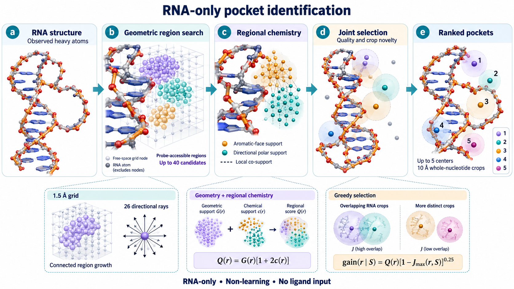

# PocketSeekR method

PocketSeekR identifies candidate ligand-binding pockets from a single observed RNA structure. Prediction is RNA-only and uses fixed structural heuristics. Parameters were calibrated offline on developmental data; no trained model or ligand label is used at inference.



This illustration is schematic. Molecular drawings and colored support points are not experimental coordinates; translucent neighborhoods indicate RNA context crops rather than cavity boundaries. See the [figure legend](figures/figure_legend.md).

## Probe-accessible regions

A deterministic RNA coordinate frame defines a grid with spacing 1.5 Å. Grid points must have local atom-surface clearance between 1.2 and 4 Å, at least three nearby atoms and at least one opposing pair of blocked rays. Twenty-six rays in thirteen opposite pairs measure local enclosure. RNA Bondi radii and a 1.2 Å probe define the occlusion and accessible connections.

Six-face adjacency retains only probe-clear full segments. Score-thresholded region growth is bounded by a 6 Å seed radius, a minimum score of half the seed score, and at least three voxels. Region quality combines the peak point score with a saturating probe-space volume factor:

```text
G(r) = max_i g_i × [0.5 + 0.5 × (1 − exp(−V_r/V0))]
V_r = voxel_count × 1.5³ ų; V0 = 36π ų
```

The representative center is a free voxel nearest the geometry-weighted mean. Geometric sorting, a 4 Å center separation and RNA crop filtering retain up to 40 candidate regions. Each crop consists of a 10 Å center neighborhood completed to entire observed nucleotides; at least 12 RNA atoms are required. Crop Jaccard overlap ≥0.8 excludes a redundant candidate.

## Regional chemical support

All original candidate-region voxels are evaluated using visible aromatic-base faces and directional base donor/acceptor geometry. Missing planes or chemical directions are omitted rather than fabricated. Potentials account for full centerline occlusion; aromatic-face and polar sums A and H are saturated into bounded fields:

```text
F_i = 1 − exp(−A_i)
P_i = 1 − exp(−H_i)
B_i = 0.75 F_i + 0.25 P_i
C_i = [sqrt(F_i (K P)_i) + sqrt(P_i (K F)_i)] / 2
c(r) = 0.5 mean(B_i) + 0.5 mean(C_i)
Q(r) = G(r) × [1 + 2 c(r)]
```

K is a row-normalized Gaussian neighborhood kernel with radius 1.5 Å, unit self-support and probe-clear connecting segments. The regional feature c is bounded between zero and one. It measures structural support, not binding free energy or verified simultaneous ligand contacts. The adopted center chemical weight is zero, so chemistry does not move the representative center.

## Joint selection

```text
gain(r | S) = Q(r) × [1 − Jmax(r,S)]^0.25
```

Jmax is the maximum Jaccard overlap between the candidate's RNA crop and selected crops, zero for an empty selected set. Each step chooses the largest gain; rounded-score ties use fixed candidate IDs. Crop overlap ≥0.8 or center distance <3 Å excludes candidates. Selection stops at five pockets or when no eligible candidate remains. Empty and short pools keep their actual size.

## Algorithm tables

Four detailed algorithm tables are supplied as [PDF](pocket_v5_algorithms.pdf) and [LaTeX source](pocket_v5_algorithms.tex), covering the main flow, region generation, chemistry and joint selection. The historical v5 label denotes the adopted source algorithm; the standalone tool is named PocketSeekR.
